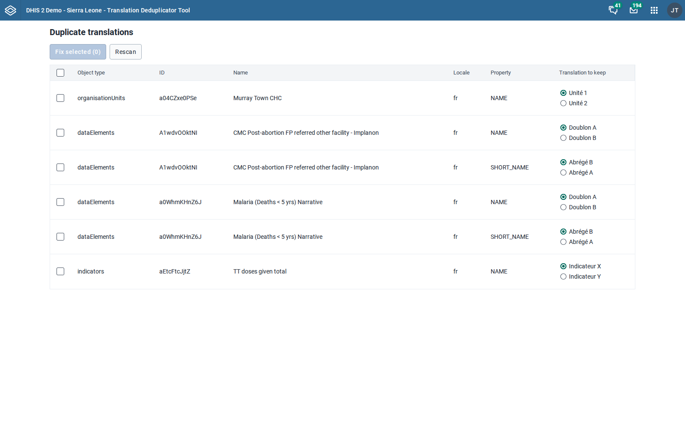
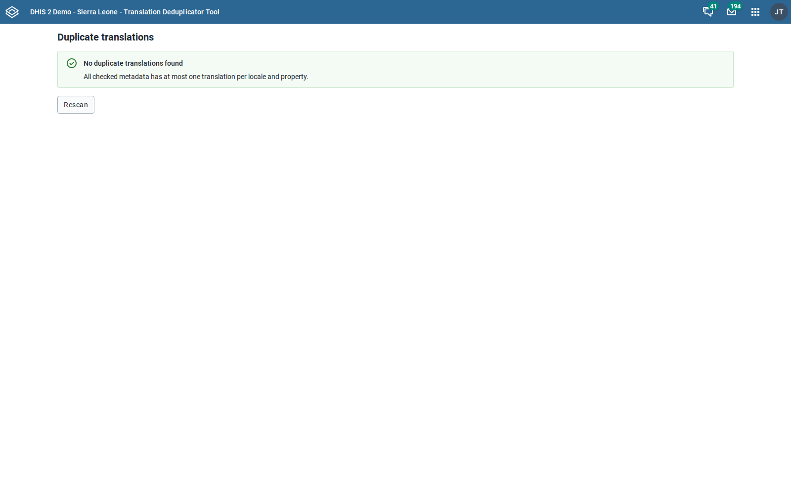
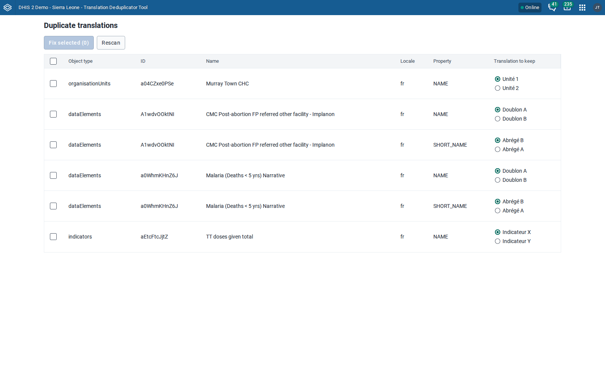
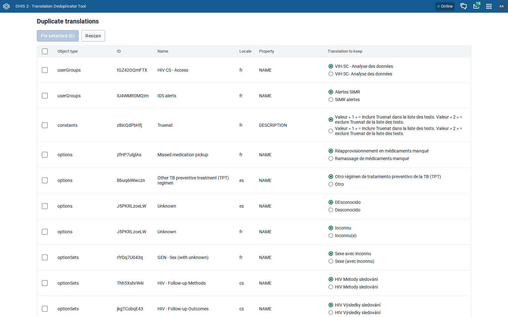

# UI test results: Translation Deduplicator Tool v1.0.0

Tested: 2026-07-09 · App: installed production bundle (`build/bundle/tool-translation-deduplicator-1.0.0.zip`) · Test data: demo seeds + 6 duplicate-translation rows seeded at DB level per instance (`tests/seed_duplicates.py`: 2 data elements, 1 indicator, 1 org unit). The Laos seed additionally contains ~270 genuine pre-existing duplicate rows.

## Instances

| Label | URL | DHIS2 version | Source |
|---|---|---|---|
| 2.40-sl | http://dhis2-agent-td40:8080 | 2.40.12 | broker, seed `dhis2-db-sierra-leone_V40.sql.gz` |
| 2.41-sl | http://dhis2-agent-td41:8080 | 2.41.9 | broker, seed `dhis2-db-sierra-leone_v41.sql.gz` |
| 2.42-sl | http://dhis2-agent-td42:8080 | 2.42.5.1 | broker, seed `dhis2-db-sierra-leone_v42.sql.gz` |
| 2.43-sl | http://dhis2-agent-td43:8080 | 2.43.0.1 | broker, seed `dhis2-db-sierra-leone_v43.sql.gz` |
| 2.41-lao | http://dhis2-agent-tdlao:8080 | 2.41.9 | broker, seed `lao_hmis_demo_v41.sql.gz` |
| 2.42-lao | http://dhis2-agent-tdlao42:8080 | 2.42.5.1 | broker, seed `lao_hmis_demo_v41` (Flyway-migrated on boot) |
| 2.43-lao | http://dhis2-agent-tdlao43:8080 | 2.43.x | broker, seed `lao_hmis_demo_v41` (Flyway-migrated on boot) |

## Results

Suite: `tests/e2e/test_dedup_app.py` (Playwright, frame-aware, screenshots per step).

| Step | 2.40-sl | 2.41-sl | 2.42-sl | 2.43-sl | 2.41-lao | 2.42-lao | 2.43-lao |
|---|---|---|---|---|---|---|---|
| App loads (in global-shell iframe?) | PASS (top) | PASS (top) | PASS (iframe) | PASS (iframe) | PASS (top) | PASS (iframe) | TBD |
| Scan completes, duplicates found | PASS | PASS | PASS | PASS | PASS | PASS | |
| Seeded duplicate rows all listed (total rows) | PASS (6) | PASS (6) | PASS (6) | PASS (6) | PASS (11) | PASS (276) | |
| Choose non-default translation | PASS | PASS | PASS | PASS | PASS | PASS | |
| Select all | PASS 6/6 | PASS 6/6 | PASS 6/6 | PASS 6/6 | PASS 11/11 | PASS 276/276 | |
| Fix selected completes | PASS | PASS | PASS | PASS | PASS (10 fixed, 1 failed: map) | PASS (275 fixed, 1 failed: map) | |
| API state after fix (seeded dupes gone, chosen value kept) | PASS | PASS | PASS | PASS | PASS | PASS | |
| Rescan: seeded duplicates gone | PASS (0 left) | PASS (0 left) | PASS (0 left) | PASS (0 left) | PASS (5 pre-existing remain) | PASS (5 pre-existing remain) | |

The 2.41-lao numbers come from the final clean run; two earlier runs on that
instance surfaced the suite-hardening needs (fix-duration timeout) and
findings M3/M4 — raw logs in `tests/e2e/output/`.

## Version-specific failures

**None in the app itself** — behavior was identical on 2.40–2.43 for both
databases. Environment-level differences worth knowing:

- `POST /api/apps` (app install) returns **204 on ≤2.41, 201 on 2.42+**.
- 2.42+ serves installed apps inside the **global-shell iframe**; ≤2.41
  serves them top-level. The app works in both (and the suite handles both).

Database-dependent failures (all versions equally, see REVIEW-FINDINGS M3/M4):

- `maps` fix fails server-side (409 unique-constraint on embedded mapViews).
- `categoryOptionCombos` fix returns 200 OK but is silently ignored by the
  server; rows reappear on rescan.

## Console/network hygiene

- All versions: `staticContent/logo_banner` 404 (demo DB has no custom logo)
  and a PWA "not a secure context" console error (plain-HTTP test rig).
  Neither is an app defect.
- Laos runs: each failed `maps` PUT logs one 409 (expected, surfaced in UI
  as a failed count).
- Pre-fix build only (finding H1): request flood + `ERR_INSUFFICIENT_RESOURCES`.
  Final build: 84 API requests for a full SL scan.

## Screenshots

Full set per version in `tests/e2e/output/<label>/`; key ones copied here:

